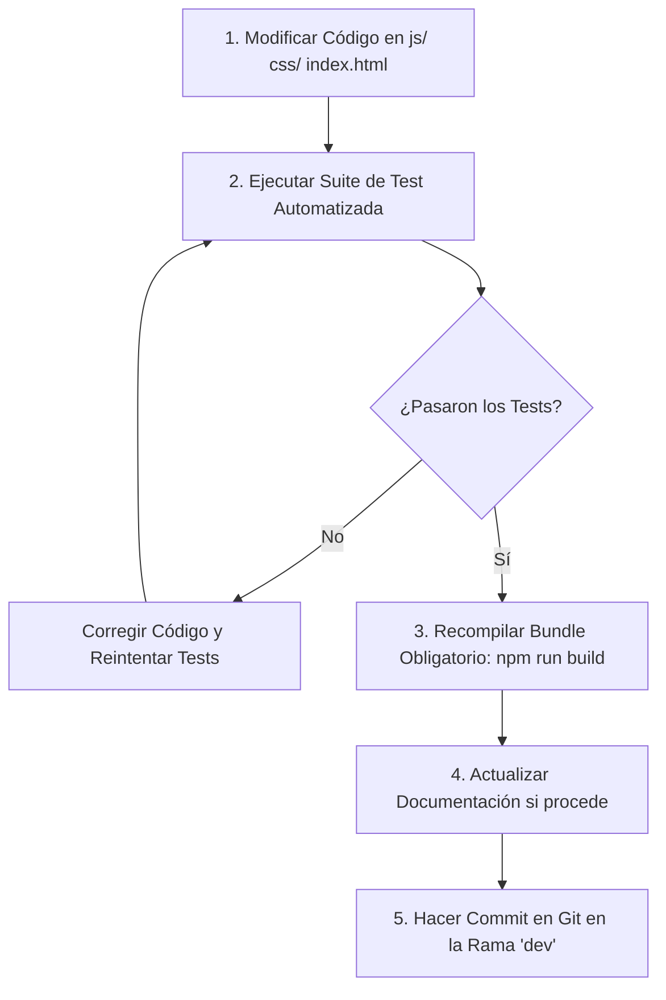

# 🤖 AGENT_GUIDELINES.md — Guía Estándar de Desarrollo y Flujo de Trabajo para Agentes IA y Desarrolladores

Este documento establece las **reglas de ingeniería, protocolo de trabajo, flujo de git, ejecución de pruebas y recompilación** para el proyecto **ZeroChat**. Cualquier asistente de IA (Antigravity, Cursor, Claude Code, Copilot, Codex, etc.) o desarrollador humano debe seguir este protocolo estrictamente ante cualquier cambio en el código.

---

## 1. 🏗️ Arquitectura del Proyecto

ZeroChat utiliza una **arquitectura modular dual**:
1. **Código Fuente Modular (Entorno de Desarrollo)**:
   - Interface HTML: `index.html`
   - Estilos CSS: `css/styles.css`
   - Módulos JavaScript: `js/*.js` (20+ módulos desacoplados).
2. **Distribución Autónoma (Producción / Entorno del Usuario)**:
   - Archivo único autónomo: `zerochat.html` (~300 KB).
   - Generado mediante el script compilador `bundle.py`.

> [!IMPORTANT]
> **NUNCA** edites `zerochat.html` directamente. Todos los cambios de lógica, interfaz o estilos deben realizarse en `js/`, `css/` o `index.html` y posteriormente recompilar `zerochat.html` ejecutando `python3 bundle.py index.html zerochat.html`.

---

## 2. 🔄 Flujo Obligatorio por Cambio (Workflow Loop)

Ante cualquier tarea, corrección de errores o nueva característica solicitada, se DEBE seguir la siguiente secuencia:



> [!IMPORTANT]
> ### 🛑 NORMA INQUEBRANTABLE DE FIN DE MODIFICACIÓN: REGENERAR SIEMPRE EL BUNDLE
> **SIEMPRE**, sin ninguna excepción, ante cualquier cambio o edición en el código fuente (`js/`, `css/`, `index.html` o dependencias):
> 1. **Verificar tests**: `npm test` (o `npm run test:unit`).
> 2. **REGENERAR EL BUNDLE**: Ejecutar obligatoriamente `npm run build` (o `python3 bundle.py index.html zerochat.html`).
> 
> **Ninguna tarea se considera finalizada** ni se debe responder al usuario como completada sin haber ejecutado `npm run build` para asegurar que la distribución `zerochat.html` refleje de forma idéntica e inmediata todos los cambios.

---

## 3. 🧪 Ejecución de Pruebas Unitarias e Integración

Antes de dar por completado un cambio o recompilar, se debe verificar que la suite de pruebas no presenta regresiones.

### Comando de Pruebas:
```bash
node --test tests/test_*.js
```

### Reglas de Pruebas:
- **Zero fallos tolerados**: Todos los tests en `tests/` deben pasar exitosamente.
- Si se añade una nueva funcionalidad o módulo, se debe agregar un archivo de test en `tests/test_<modulo>.js`.
- No se deben comentar ni deshabilitar pruebas fallidas para enmascarar errores.

---

## 4. 📦 Recompilación del Bundle Autonómicamente

Una vez que los tests pasen correctamente, se debe actualizar la distribución ejecutable autónoma:

### Comando de Compilación:
```bash
npm run build
# Equivalente manual: python3 bundle.py index.html zerochat.html
```

El script detecta las hojas de estilo y scripts locales declarados por el HTML base, preserva su orden, verifica la integridad del JavaScript, minifica el CSS, elimina comentarios, comprime el código con `Gzip (Level 9)` y genera el archivo de salida indicado.

---

## 5. 🌿 Convenciones de Git y Gestión de Ramas

### 1. Rama de Trabajo Estándar:
- **Toda la labor de desarrollo se realiza en la rama `dev`**.
- Antes de iniciar cambios o hacer commit, verificar la rama actual con `git status` o conmutar con `git checkout dev`.

### 2. Formato de Mensajes de Commit:
Se utiliza la convención **Conventional Commits**:
- `feat: ...` — Nueva funcionalidad.
- `fix: ...` — Corrección de errores.
- `refactor: ...` — Refactorización de código sin cambio de comportamiento.
- `docs: ...` — Cambios en documentación (`README.md`, `AGENT_GUIDELINES.md`).
- `test: ...` — Adición o modificación de pruebas unitarias.
- `chore: ...` — Tareas de mantenimiento o build.

### 3. Protocolo de Commit:
```bash
git add .
git commit -m "<tipo>: <descripción breve y clara de los cambios>"
```

---

## 6. 📝 Convenciones de Código y Estilo

1. **JavaScript Nativo (ES6+)**:
   - Sin librerías ni frameworks pesados (React, Vue, Angular).
   - Patrón UMD/Factory para soporte en navegador y Node.js.
   - Preservar compatibilidad con entornos `file://`, `http://` y `https://`.
2. **Persistencia e IndexedDB**:
   - Utilizar el prefijo de almacenamiento `zerochat_` y la base de datos `ZeroChatDB`.
3. **Idiomas (i18n)**:
   - Mantener sincronizados los diccionarios `es` y `en` en `js/i18n.js`.

---

## 7. 📄 Actualización de Documentación y Roadmap

Si los cambios afectan a:
- Requisitos del proyecto o estructura de archivos ➜ Actualizar `README.md`.
- Flujos de trabajo, comandos o reglas para agentes ➜ Actualizar `AGENT_GUIDELINES.md`.
- Iniciativas de calidad o mejoras técnicas pendientes ➜ Actualizar `ROADMAP.md`.
- Comentarios JSDoc / API en módulos ➜ Actualizar los comentarios del código fuente.
